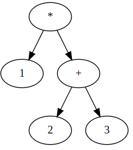
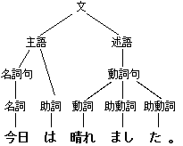
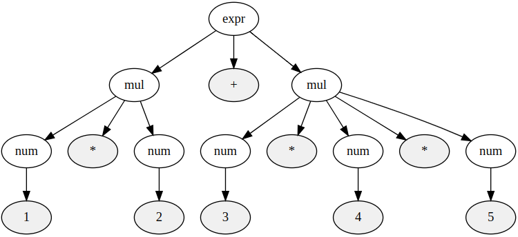
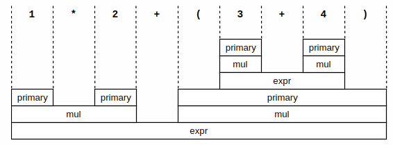
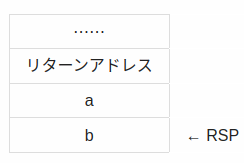
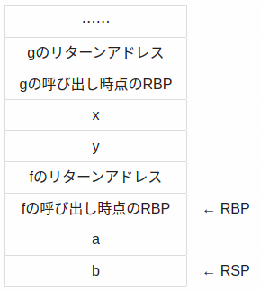

# 参考
 - [低レイヤを知りたい人のためのCコンパイラ作成入門](https://www.sigbus.info/compilerbook)のノート  
 - [chibicc](https://github.com/rui314/chibicc/)

# 目次
- [参考](#参考)
- [目次](#目次)
- [Step0 Cとそれに対応するアセンブラ](#step0-cとそれに対応するアセンブラ)
- [Step1 整数1個をコンパイルする言語の作成](#step1-整数1個をコンパイルする言語の作成)
- [Step2 加減算のできるコンパイラの作成](#step2-加減算のできるコンパイラの作成)
- [Step3 字句解析（≒Tokenize）](#step3-字句解析tokenize)
  - [エラーメッセージを改良](#エラーメッセージを改良)
- [Step4 構文解析とスタックマシンの実装](#step4-構文解析とスタックマシンの実装)
  - [構文解析](#構文解析)
  - [抽象構文木(AST: Abstract Syntax Tree )](#抽象構文木ast-abstract-syntax-tree-)
  - [抽象構文木と具象構文木(Concrete Syntax Tree)の違い](#抽象構文木と具象構文木concrete-syntax-treeの違い)
  - [生成規則（Production Rule）](#生成規則production-rule)
  - [バックナウアー・ナウア形式(BNF : Backus–Naur form)](#バックナウアーナウア形式bnf--backusnaur-form)
  - [拡張バックナウアー・ナウア形式(EBNF : Extended BNF)](#拡張バックナウアーナウア形式ebnf--extended-bnf)
  - [四則演算](#四則演算)
  - [再帰下降構文解析 (Recursive Descent Parsing)](#再帰下降構文解析-recursive-descent-parsing)
  - [再帰下降構文解析の具体的な実装](#再帰下降構文解析の具体的な実装)
  - [スタックマシンの考え方](#スタックマシンの考え方)
  - [レジスタマシンとスタックマシン](#レジスタマシンとスタックマシン)
  - [x86-64におけるスタックマシンの実現方法](#x86-64におけるスタックマシンの実現方法)
- [Step5 四則演算のできる言語の作成](#step5-四則演算のできる言語の作成)
- [Step6 単項プラスと単項マイナス](#step6-単項プラスと単項マイナス)
- [Step7 比較演算子](#step7-比較演算子)
  - [字句解析の変更](#字句解析の変更)
  - [構文解析の変更](#構文解析の変更)
  - [比較の命令コード](#比較の命令コード)
- [Step8 ファイル分割とMakefileの変更](#step8-ファイル分割とmakefileの変更)
- [Step9 関数とローカル変数の実装](#step9-関数とローカル変数の実装)
  - [関数とローカル変数の考え方](#関数とローカル変数の考え方)
  - [アセンブリ](#アセンブリ)

# Step0 Cとそれに対応するアセンブラ
機械語とほぼ1対1で人間にとって読みやすい言語  
`objectdump`の逆アセンブルで、アセンブラが見れる。  
```shell
$ objdump -d -M intel /bin/ls | head -n 9
/bin/ls:     file format elf64-x86-64


Disassembly of section .init:

0000000000004000 <.init>: # 開始アドレスが表示
    4000:       f3 0f 1e fa             endbr64 # セキュリティ要件
    4004:       48 83 ec 08             sub    rsp,0x8 # 解説
```

 - 4004は機械語が入っているメモリアドレスで、プログラムカウンタが0x4004の時に実行される。  
 - RSPというレジスタから8を引く（substract）

ここで、C言語をコンパイルした後に期待するアセンブラを紹介する
```c
int main() {
  return 42;
}

// 期待するアセンブリ
.intel_syntax noprefix　// intel記法の採用の宣言
.globl main
main:
        mov rax, 42 // RAXレジスタに42をコピー
        ret

```

 - Intel記法とUNIX等で広く使われるAT&T記法がある。
 - 関数の返値はRAXレジスタにmov（コピー）する

【コラム】  
gccやobjdumpはデフォルトではAT&T記法でアセンブリを出力する。  
どちらの記法を使っても、生成される機械語命令列は同一となる。
```assembly
mov rbp, rsp   // Intel
mov %rsp, %rbp // AT&T

mov rax, 8     // Intel
mov $8, %rax   // AT&T

mov [rbp + rcx * 4 - 8], rax // Intel
mov %rax, -8(rbp, rcx, 4)    // AT&T
```
関数呼び出しの場合は下記
```c
int plus(int x, int y) {
  return x + y;
}

int main() {
  return plus(3, 4);
}

// 期待するアセンブリ
.intel_syntax noprefix
.globl plus, main

plus:
        add rsi, rdi // RSIレジスタとRDIレジスタを足した結果がRSIレジスタに書き込む
        mov rax, rsi // RAXレジスタにRSIレジスタをコピー
        ret // スタックからアドレスを1つポップし、そのアドレスにジャンプ

main:
        mov rdi, 3 // RDIレジスタに3をコピー
        mov rsi, 4 // RDIレジスタに4をコピー
        call plus
        ret
```

 - 関数コール時の第一引数はRDIレジスタにmov（コピー）する
 - 関数コール時の第二引数はRDIレジスタにmov（コピー）する
 - x86-64の整数演算命令(add)は通常2つのレジスタしか受け取らないため、第1引数のレジスタの値を上書きする形で結果が保存される
 - retはスタックからアドレスを1つポップし、そのアドレスにジャンプする

# Step1 整数1個をコンパイルする言語の作成
step-by-stepで、最小構成で標準入力の値からアセンブリを出力させる。  
下記は42をアセンブラが受け取った際の成果物例

```assembly
.intel_syntax noprefix
.globl main

main:
        mov rax, 42
        ret
```
アセンブラの実装
```c
#include <stdio.h>
#include <stdlib.h>

int main(int argc, char **argv) {
  if (argc != 2) {
    fprintf(stderr, "引数の数が正しくありません\n");
    return 1;
  }

  printf(".intel_syntax noprefix\n");
  printf(".globl main\n");
  printf("main:\n");
  printf("  mov rax, %d\n", atoi(argv[1]));
  printf("  ret\n");
  return 0;
}
```
アセンブルと実行  
```bash
cc -o 9cc 9cc.c
./9cc 42 > tmp.s
cc -o tmp tmp.s
./tmp
echo $? #42
```

# Step2 加減算のできるコンパイラの作成
 - addとsubが加算と減算
```assembly
.intel_syntax noprefix
.globl main

main:
        mov rax, 5
        add rax, 20
        sub rax, 4
        ret
```

加算/減算の式を言語として説明すると、  
1. 最初に数字   
2. 0以上の項（＋もしくはーの後ろに文字がある）  

となる。  
これには、項を解析する関数として`strtol`がリーズナブルである。  
strtol関数は、文字列を長整数（long int）に変換する。  
数値を含む文字列とその文字列内での数値の解析を開始するポインタ、数値の解析を終了させるポインタのアドレス、および基数を引数に取る。
```c
char *p = argv[1];  

printf(".intel_syntax noprefix\n");
printf(".globl main\n");
printf("main:\n");
printf("  mov rax, %ld\n", strtol(p, &p, 10));

// 文字列を1文字ずつ走査し、+や-に遭遇するたびに、
// それに続く数値をraxに加算または減算
while (*p) { // デリファレンスにより実際の文字を捜査
	if (*p == '+') {
		p++;  // charサイズ分移動し、次の文字へ
		// &pは、strtol関数が数値の解析を終了した後の位置を示すポインタを
		// 格納するための変数のアドレスを指す
		// 例えば123+456であればstrtolは123を返し、pは第二引数により「+」を指す
		printf("  add rax, %ld\n", strtol(p, &p, 10));
		continue;
	}

	if (*p == '-') {
		p++;
		printf("  sub rax, %ld\n", strtol(p, &p, 10));
		continue;
	}

	fprintf(stderr, "予期しない文字です: '%c'\n", *p);
	return 1;
}

printf("  ret\n");
```

# Step3 字句解析（≒Tokenize）
step2では、空白文字等に対応できない。  
そのため、意味のある単語に変換する必要がある。  
5+20-4は5、+、20、-、4という5つの単語でできていると考えることができ、これを`token`と呼ぶ。  
tokenの間にある空白文字は、tokenを区切るために存在しているだけで、単語を構成する一部分ではないため、空白文字等は取り除く。  
このように、文字列をtoken列に分割することを`tokenize`という。   
またtoken列の各tokenを分類して型をつけることができる利点もある。   
単なる文字列に分割するだけではなく、各tokenを解釈することで、token列を消費するときに考えなければならないことが減る。   
(現時点では+,-,数字の型がアセンブラとしてある。)  

## エラーメッセージを改良
エラー時に、その場所がわかるように補足する。
```sh
$ ./9cc "1+3++" > tmp.s
1+3++
    ^ 数ではありません

$ ./9cc "1 + foo + 5" > tmp.s
1 + foo + 5
    ^ トークナイズできません
```

# Step4 構文解析とスタックマシンの実装
## 構文解析
乗除算や優先順位のカッコ、すなわち*、/、()を言語に追加したい。  
しかし、これには掛け算や割り算は式の中で最初に計算しなければいけないというルールがある。  
どの演算子が最初に演算されるのかというルールを「演算子の優先順位」（operator precedence）といい、  
今までのようにトークンを前から処理するだけでは実現できない。  
`字句解析（≒tokenize）では、各文字列を適切な粒度で分割するが、文字列全体から優先的に計算すべきものを解析することを構文解析という`  
構文解析では、字句解析によって生成されたtoken列を入力として受け取り、プログラムの構造を表す構文木を生成する。  

## 抽象構文木(AST: Abstract Syntax Tree )
構文解析におけるゴールは抽象構文木を構築することだ。  
下記の画像のようなグループ化のためのカッコなどの冗長な要素を木の中に残さずになるべくコンパクトに表現した構文木のことを抽象構文木（abstract syntax tree、AST）という。  
  


## 抽象構文木と具象構文木(Concrete Syntax Tree)の違い
入力に含まれる全てのトークンを含んだ、文法に完全に一対一でマッチしている構文木を「具象構文木(CST)」という  
ソースコードとCSTは完全に1対1となるため、カッコ等の記述も省略されない  
CSTは計算の優先順位や結合性（「左から計算する」というルール等）を直接的に表現しているわけではなく、これらはCSTを解析してASTを構築する際に考慮される。

## 生成規則（Production Rule）  
構文解析が抽象構文木をどのように構築するべきか、その構築ルールを`生成規則`という。  
言い換えると、生成規則は、言語の文法を定義する一連のルールであり、これに従って有効なプログラムを生成する。  
これらの規則を表現するために、バックナウアー・ナウア形式（BNF）または拡張バックナウアー・ナウア形式（EBNF）が一般的に利用される。  
また生成規則を利用する上で、よく利用される用語の定義を下記に記載する。  

| 用語                               | 定義                                                       |
| ---------------------------------- | ---------------------------------------------------------- |
| 非終端記号（Non-terminal symbols） | 他のルールに展開される記号                                 |
| 終端記号（Terminal symbols）       | 実際のプログラムコードの要素で、これ以上展開されない記号   |
| 開始記号（Start symbol）           | 文法生成の出発点となる非終端記号                           |
| 生成規則（Production rules）       | 非終端記号を終端記号や他の非終端記号に変換するためのルール |

---

## バックナウアー・ナウア形式(BNF : Backus–Naur form)

例：

```
A ::= B
B ::= "fizz" | "buzz" | B C
C ::= "fizz" | "buzz"

fizz
fizzbuzz
buzzfizz
...
```

## 拡張バックナウアー・ナウア形式(EBNF : Extended BNF)

EBNFはBNFの拡張であり、より簡潔に文法を表現でき、下記のルールが追加されている。

| 書き方  | 意味                 |
| ------- | -------------------- |
| A\*     | Aの0回以上の繰り返し |
| A?      | Aまたはε             |
| A \| B  | AまたはB             |
| ( ... ) | グループ化           |


例：

```
A = ("fizz" | "buzz")*
```

## 四則演算
ENBFの生成規則に則った四則演算は下記で示される  
expr(式)が直接num(数)を展開せず、今回はexprはmul(乗除算)を経由してnumに展開する。
```
expr = mul ("+" mul | "-" mul)*
mul  = num ("*" num | "/" num)*
```
  
上記の木構造は、加減算より乗除算が常に木の末端方向に現れるようになる。  
加減算を含むexprから乗除算を含むmulは生成されるが、その逆はないため、乗除算の下に加減算がある木構造は作れないようになっている。  
EBNF式を見ると、expr->mul->numのように、必ず再帰を含まない生成規則となっている。  
再帰を使わずにループ構造を用いて入力を解析することを逐次解析と呼ばれることもある。  

## 再帰下降構文解析 (Recursive Descent Parsing)
```
expr    = mul ("+" mul | "-" mul)*
mul     = primary ("*" primary | "/" primary)*
primary = num | "(" expr ")"
```
上記のENBF式は、expr->mul->primary->(num || expr)のように再起を含む生成規則となっている。  
再帰を含んでいても、展開すれば自ずと展開結果は末端に現れるため、末端から処理すれば問題なく計算が可能だ。  
このように、再帰的に解析して抽象構文木を構築することを`再帰下降構文解析`と呼ぶ。  

再帰:  
exprがmulを含み、mulが再びprimaryやexprを再帰的に含むことを示す   
  
下降:  
構文木はexprから始まり、mul、primaryと上から下に進みながら構築され、各ノードが具体的な要素を含む子ノードへと展開されていくことを示す  

## 再帰下降構文解析の具体的な実装
初めに、各ノードの種類を識別でき、ノードを一意に決めることができる構造体を用意する。  
```c
// 抽象構文木のノードの種類
typedef enum {
  ND_ADD, // +
  ND_SUB, // -
  ND_MUL, // *
  ND_DIV, // /
  ND_NUM, // 整数
} NodeKind;

// 抽象構文木のノードの型
typedef struct Node Node;
struct Node {
  NodeKind kind; // ノードの型
  Node *lhs;     // 左辺
  Node *rhs;     // 右辺
  int val;       // kindがND_NUMの場合のみ使う
};
```
また新規ノードを作成する関数を用意する
```c
Node *new_node(NodeKind kind, Node *lhs, Node *rhs) {
  Node *node = calloc(1, sizeof(Node));
  node->kind = kind;
  node->lhs = lhs;
  node->rhs = rhs;
  return node;
}

Node *new_node_num(int val) {
  Node *node = calloc(1, sizeof(Node));
  node->kind = ND_NUM;
  node->val = val;
  return node;
}
```
次に、ENBF式で記述される各生成規則（expr, mul, primary）を実装する。  
例として、再帰的な要素を持つprimaryの実装は下記の通り。  
```c
Node *primary() {
  // 次のトークンが"("なら、"(" expr ")"のはずなので、expr関数をコールする
  if (consume('(')) {
    Node *node = expr();
    expect(')');
    return node;
  }

  // そうでなければ数値のはず
  return new_node_num(expect_number());
}
```
上記のように実装していくと、呼び出し関係の例は下記のようになる  
  
今回のパーサはトークンを1つだけ先読みし、どの関数を呼び出すか、あるいはリターンするかを決定する。  
このようにトークンを1つだけ先読みする再帰下降パーサのことをLL(1)パーサといい、LL(1)パーサが書ける文法のことをLL(1)文法という

## スタックマシンの考え方
前章の復習として、加減算のできるコンパイラでは、RAXを結果のレジスタとして、そこに加減算を実施していた
```
.intel_syntax noprefix
.globl main

main:
        mov rax, 5
        add rax, 20
        sub rax, 4
        ret
```
しかし、2*3+4*5では、足し算の前に2*3と4*5の結果を保持する必要がある。  
このため、結果をスタックにPUSH/POPする`仮想スタックマシン`の考え方を取り入れる。  
下記は仮想スタックマシンによる2*3+4*5の計算方法である。
```
PUSH 2
PUSH 3
MUL

PUSH 4
PUSH 5
MUL

ADD
```

上記の考え方をASTに当てはめてみる。  
基本的には、左の部分木と右の部分木をコンパイルし、各生成規則を適用する。  
例として、1*(2+3)を考える。  
  

```
# 左の部分木をコンパイル
PUSH 1 
# 右の部分木をコンパイル
PUSH 2 
PUSH 3
ADD
# 生成規則適用
MUL
```

## レジスタマシンとスタックマシン
レジスタマシンは値をロードし、スタックマシンは値をプッシュする。  
スタックマシンは、操作に使用する位置がスタックポインタの指す場所であり、レジスタ数などのような特定ハードウェアに依存しないという利点がある。  
```
レジスタマシン
1 レジスタAに数値1をロード
2 レジスタBに数値2をロード
3 レジスタAとBを加算

スタックマシン
1 数値1をスタックにプッシュ
2 数値2をスタックにプッシュ
3 スタックから数値を2つポップし、加算
4 結果を再びスタックにプッシュ
```
代表例として、レジスタマシンはLuaVM、スタックマシンはJVMで採用されており、基本的にはスタックマシンが採用される場合が多い  
※LuaVMがレジスタマシンを採用する理由として、Luaは各命令が明示的にレジスタを操作することが挙げられる
また多くの命令セットアーキテクチャ(x86-64, RISC-V)はレジスタを中心とした高速な演算を設計思想を持ち、レジスタマシンとして動いている。  

## x86-64におけるスタックマシンの実現方法
前の章では仮想のスタックマシンを考えたため、x86-64のレジスタマシンで動くスタックマシンをエミュレートする必要がある。  

まずスタックの先頭の要素を指すレジスタとして、x86-64ではRSPレジスタが
採用されており、push/pop命令で暗黙的に使用される。  

具体例として、1+2をx86-64をスタックマシンと見立ててコンパイルする
```assembly
// 左辺と右辺をプッシュ
push 1
push 2

// 左辺と右辺をRAXとRDIにポップして足す
pop rdi // スタックから2がポップされ、RDIレジスタに格納される
pop rax // スタックから1がポップされ、RDIレジスタに格納される
add rax, rdi // RAXレジスタにRDIレジスタの値を加算し、結果の3をRAXレジスタに格納

// 足した結果をスタックにプッシュ
push rax
```

# Step5 四則演算のできる言語の作成
下記に実装  
[step05](./steps/step05/test05.c)

# Step6 単項プラスと単項マイナス
5-3のように2つの項をとる演算子を2項演算子(binary operator)と呼び、逆に+3のように1つの項だけをとる演算子を単独演算子(unary operator)と呼ぶ。  
C言語では+-や&*などの単項演算子が存在するが、このステップでは+-だけを実装する。  

ここで+-は、単項と2項という、似て異なる定義の同名の演算子が複数存在していると考え、生成規則にunaryを追加する。  
```
## 前章
expr    = mul ("+" mul | "-" mul)*
mul     = primary ("*" primary | "/" primary)*
primary = num | "(" expr ")"

## unary追加後
expr    = mul ("+" mul | "-" mul)*
mul     = unary ("*" unary | "/" unary)*
unary   = ("+" | "-")? primary ## +-が0以上1未満で、その後にprimaryが続く
primary = num | "(" expr ")"
```

ここで新しい生成規則のunaryを下記のように追加実装する
```c
Node *unary() {
  if (consume('+'))
    return primary();
  if (consume('-'))
    return new_node(ND_SUB, new_node_num(0), primary());
  return primary();
}
```
下記に実装  
[step06](./steps/step06/test06.c)

# Step7 比較演算子
2項演算子である<,<=,>,>=,==,!=を実装する。  
## 字句解析の変更
まず初めに、今までのTokenizerの長さは1で固定であるため、それらを一般化する。
```c
struct Token {
  TokenKind kind; // トークンの型
  Token *next;    // 次の入力トークン
  int val;        // kindがTK_NUMの場合、その数値
  char *str;      // トークン文字列
  int len;        // トークンの長さを追加
};
```

加えて、consumeやexpectも変更する。
```c
bool consume(char op) {
  if (token->kind != TK_RESERVED || token->str[0] != op) return false;
  token = token->next;
  return true;
}


bool consume(char *op) {
  if (token->kind != TK_RESERVED ||
      strlen(op) != token->len ||
      memcmp(token->str, op, token->len))
    return false;
  token = token->next;
  return true;
}
```

## 構文解析の変更
比較演算子を加えた文法の優先順位(降順)は下記と鳴る
```
== !=            equality
< <= > >=        relational
+ -              add
* /              mul
単項+ 単項-       unary
()               primary
```
これに沿って、EBNF生成規則を書き換える。
```
## 前章
expr    = mul ("+" mul | "-" mul)*
mul     = unary ("*" unary | "/" unary)*
unary   = ("+" | "-")? primary
primary = num | "(" expr ")"

## 変更後
expr       = equality
equality   = relational ("==" relational | "!=" relational)*
relational = add ("<" add | "<=" add | ">" add | ">=" add)*
add        = mul ("+" mul | "-" mul)*
mul        = unary ("*" unary | "/" unary)*
unary      = ("+" | "-")? primary
primary    = num | "(" expr ")"
```

## 比較の命令コード
x86-64で比較は`cmp命令`を利用し、主に下記のように利用する。  
```assembly
pop rdi            // スタックから値をPOPしてRDIレジスタに格納
pop rax            // スタックから値をPOPしてRAXレジスタに格納
cmp rax, rdi       // RAXとRDIの値を比較し、結果をフラグレジスタに格納
sete al            // 比較結果が等しい場合、ALレジスタに1をセット（ゼロフラグがセットされている場合）、そうでなければ0をセット
movzx rax, al      // alの8ビットの値を64ビットのRAXレジスタにゼロ拡張してコピー
```
sete命令は「Set if Equal」の略で、直前の比較（cmp命令を含む）の結果を基に、指定した8ビットレジスタに0または1をセットする。  
なお、alレジスタとは、RAXレジスタの下位8ビットを指す。  
movzx命令は「Move with Zero Extend」の略で、指定された小さなレジスタ（この場合は8ビットのal）をゼロ拡張して、より大きなレジスタ（この場合は64ビットのrax）にコピーする。　　

下記に実装  
[step06](./steps/step07/test07.c)

# Step8 ファイル分割とMakefileの変更
省略

# Step9 関数とローカル変数の実装
## 関数とローカル変数の考え方
関数では、そのトップにリターンアドレスが入っており、さらに変数があれば変数分RSPを押し下げる。  
このように 関数呼び出しごとに確保されるメモリ領域(図だとa, b)を`関数フレーム`や`アクティベーションレコード`と呼ぶ。  
  
一方で、途中の計算結果にはRSPを使ったスタックにプッシュ／ポップしており、RSPの値は頻繁に変更されるため、aやbにはRSPからの固定のオフセットでアクセスすることができない。  
したがって、RSPとは別に、現在の関数フレームの開始位置を常に指すレジスタを新しく利用する。  
そのようなレジスタを`ベースレジスタ`、ベースレジスタに入っている値を`ベースポインタ`と呼び、x86-64では慣習として`RBPレジスタ`をベースレジスタとして使用する。  
  
上記の図のように、RBPレジスタを利用することで、aにはRBP-8, bにはRBP-16というアドレスで常にアクセスすることができる。  

## アセンブリ
```assembly
push rbp
mov rbp, rsp
sub rsp, 16
```

