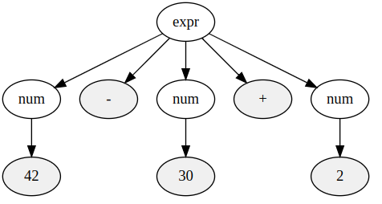

# 参考
 - [低レイヤを知りたい人のためのCコンパイラ作成入門](https://www.sigbus.info/compilerbook)のノート  
 - [chibicc](https://github.com/rui314/chibicc/)

# 目次
- [参考](#参考)
- [目次](#目次)
- [機械語とアセンブラ](#機械語とアセンブラ)
  - [Step0 (Cとそれに対応するアセンブラ)](#step0-cとそれに対応するアセンブラ)
- [電卓レベルの言語の作成](#電卓レベルの言語の作成)
  - [Step1 (整数1個をコンパイルする言語の作成)](#step1-整数1個をコンパイルする言語の作成)
  - [Step2 (加減算のできるコンパイラの作成)](#step2-加減算のできるコンパイラの作成)
  - [Step3 (トークナイザを導入)](#step3-トークナイザを導入)
    - [エラーメッセージを改良](#エラーメッセージを改良)
  - [Step4 再帰下降構文解析とスタックマシンの実装](#step4-再帰下降構文解析とスタックマシンの実装)
    - [抽象構文木(AST: Abstract Syntax Tree )](#抽象構文木ast-abstract-syntax-tree-)
    - [生成規則（Production Rule）](#生成規則production-rule)
    - [バックナウアー・ナウア形式(BNF : Backus–Naur form)](#バックナウアーナウア形式bnf--backusnaur-form)
    - [拡張バックナウアー・ナウア形式(EBNF : Extended BNF)](#拡張バックナウアーナウア形式ebnf--extended-bnf)
    - [具象構文木(Concrete Syntax Tree)](#具象構文木concrete-syntax-tree)

# 機械語とアセンブラ
## Step0 (Cとそれに対応するアセンブラ)
機械語とほぼ1対1で人間にとって読みやすい言語  
`objectdump`の逆アセンブルで、アセンブラが見れる。  
```shell
$ objdump -d -M intel /bin/ls | head -n 9
/bin/ls:     file format elf64-x86-64


Disassembly of section .init:

0000000000004000 <.init>: # 開始アドレスが表示
    4000:       f3 0f 1e fa             endbr64 # セキュリティ要件
    4004:       48 83 ec 08             sub    rsp,0x8 # 解説
```

 - 4004は機械語が入っているメモリアドレスで、プログラムカウンタが0x4004の時に実行される。  
 - RSPというレジスタから8を引く（substract）

ここで、C言語をコンパイルした後に期待するアセンブラを紹介する
```c
// C言語
int main() {
  return 42;
}

// 期待するアセンブリ
.intel_syntax noprefix　// intel記法の採用の宣言
.globl main
main:
        mov rax, 42 // RAXレジスタに42をコピー
        ret

```

 - Intel記法とUNIX等で広く使われるAT&T記法がある。
 - 関数の返値はRAXレジスタにmov（コピー）する

【コラム】  
gccやobjdumpはデフォルトではAT&T記法でアセンブリを出力する。  
どちらの記法を使っても、生成される機械語命令列は同一となる。
```c
mov rbp, rsp   // Intel
mov %rsp, %rbp // AT&T

mov rax, 8     // Intel
mov $8, %rax   // AT&T

mov [rbp + rcx * 4 - 8], rax // Intel
mov %rax, -8(rbp, rcx, 4)    // AT&T
```
関数呼び出しの場合は下記
```c
// C言語
int plus(int x, int y) {
  return x + y;
}

int main() {
  return plus(3, 4);
}

// 期待するアセンブリ
.intel_syntax noprefix
.globl plus, main

plus:
        add rsi, rdi // RSIレジスタとRDIレジスタを足した結果がRSIレジスタに書き込む
        mov rax, rsi // RAXレジスタにRSIレジスタをコピー
        ret // スタックからアドレスを1つポップし、そのアドレスにジャンプ

main:
        mov rdi, 3 // RDIレジスタに3をコピー
        mov rsi, 4 // RDIレジスタに4をコピー
        call plus
        ret
```

 - 関数コール時の第一引数はRDIレジスタにmov（コピー）する
 - 関数コール時の第二引数はRDIレジスタにmov（コピー）する
 - x86-64の整数演算命令(add)は通常2つのレジスタしか受け取らないため、第1引数のレジスタの値を上書きする形で結果が保存される
 - retはスタックからアドレスを1つポップし、そのアドレスにジャンプする

# 電卓レベルの言語の作成
## Step1 (整数1個をコンパイルする言語の作成)
step-by-stepで、最小構成で標準入力の値からアセンブリを出力させる。  
下記は42をアセンブラが受け取った際の成果物例

```c
.intel_syntax noprefix
.globl main

main:
        mov rax, 42
        ret
```
アセンブラの実装
```c
#include <stdio.h>
#include <stdlib.h>

int main(int argc, char **argv) {
  if (argc != 2) {
    fprintf(stderr, "引数の数が正しくありません\n");
    return 1;
  }

  printf(".intel_syntax noprefix\n");
  printf(".globl main\n");
  printf("main:\n");
  printf("  mov rax, %d\n", atoi(argv[1]));
  printf("  ret\n");
  return 0;
}
```
アセンブルと実行  
```bash
cc -o 9cc 9cc.c
./9cc 42 > tmp.s
cc -o tmp tmp.s
./tmp
echo $? #42
```

## Step2 (加減算のできるコンパイラの作成)
 - addとsubが加算と減算
```c
.intel_syntax noprefix
.globl main

main:
        mov rax, 5
        add rax, 20
        sub rax, 4
        ret
```

加算/減算の式を言語として説明すると、  
1. 最初に数字   
2. 0以上の項（＋もしくはーの後ろに文字がある）  

となる。  
これには、項を解析する関数として`strtol`がリーズナブルである。  
strtol関数は、文字列を長整数（long int）に変換する。  
数値を含む文字列とその文字列内での数値の解析を開始するポインタ、数値の解析を終了させるポインタのアドレス、および基数を引数に取る。
```c
char *p = argv[1];  

printf(".intel_syntax noprefix\n");
printf(".globl main\n");
printf("main:\n");
printf("  mov rax, %ld\n", strtol(p, &p, 10));

// 文字列を1文字ずつ走査し、+や-に遭遇するたびに、
// それに続く数値をraxに加算または減算
while (*p) { // デリファレンスにより実際の文字を捜査
	if (*p == '+') {
		p++;  // charサイズ分移動し、次の文字へ
		// &pは、strtol関数が数値の解析を終了した後の位置を示すポインタを
		// 格納するための変数のアドレスを指す
		// 例えば123+456であればstrtolは123を返し、pは第二引数により「+」を指す
		printf("  add rax, %ld\n", strtol(p, &p, 10));
		continue;
	}

	if (*p == '-') {
		p++;
		printf("  sub rax, %ld\n", strtol(p, &p, 10));
		continue;
	}

	fprintf(stderr, "予期しない文字です: '%c'\n", *p);
	return 1;
}

printf("  ret\n");
```

## Step3 (トークナイザを導入)
step2では、空白文字等に対応できない。  
そのため、意味のある単語に変換する必要がある。  
5+20-4は5、+、20、-、4という5つの単語でできていると考えることができ、これを`token`と呼ぶ。  
tokenの間にある空白文字は、tokenを区切るために存在しているだけで、単語を構成する一部分ではないため、空白文字等は取り除く。  
このように、文字列をtoken列に分割することを`tokenize`という。   
またtoken列の各tokenを分類して型をつけることができる利点もある。   
単なる文字列に分割するだけではなく、各tokenを解釈することで、token列を消費するときに考えなければならないことが減る。   
(現時点では+,-,数字の型がアセンブラとしてある。)  

### エラーメッセージを改良
エラー時に、その場所がわかるように補足する。
```sh
$ ./9cc "1+3++" > tmp.s
1+3++
    ^ 数ではありません

$ ./9cc "1 + foo + 5" > tmp.s
1 + foo + 5
    ^ トークナイズできません
```

## Step4 再帰下降構文解析とスタックマシンの実装
乗除算や優先順位のカッコ、すなわち*、/、()を言語に追加したい。  
しかし、これには掛け算や割り算は式の中で最初に計算しなければいけないというルールがある。  
どの演算子が最初に演算されるのかというルールを「演算子の優先順位」（operator precedence）といい、  
今までのようにトークンを前から処理するだけでは実現できない。  
(再帰下降構文解析を実施する必要がある（後述）)  
コンパイラは、まず構文解析を行って入力のトークン列を抽象構文木に変換し、その構文木を次はアセンブリに変換する。  
### 抽象構文木(AST: Abstract Syntax Tree )
構文解析におけるゴールは抽象構文木を構築することだ。  
下記の画像のようなグループ化のためのカッコなどの冗長な要素を木の中に残さずになるべくコンパクトに表現した構文木のことを抽象構文木（abstract syntax tree、AST）という。  
  


### 生成規則（Production Rule）  
生成規則とは、言語の文法を定義する一連のルールであり、これに従って有効なプログラムを生成する。  
これらの規則は形式言語理論に基づいており、通常、バックナウアー・ナウア形式（BNF）または拡張バックナウアー・ナウア形式（EBNF）で記述される。  


| 用語                               | 定義                                                       |
| ---------------------------------- | ---------------------------------------------------------- |
| 非終端記号（Non-terminal symbols） | 他のルールに展開される記号                                 |
| 終端記号（Terminal symbols）       | 実際のプログラムコードの要素で、これ以上展開されない記号   |
| 開始記号（Start symbol）           | 文法生成の出発点となる非終端記号                           |
| 生成規則（Production rules）       | 非終端記号を終端記号や他の非終端記号に変換するためのルール |

---

### バックナウアー・ナウア形式(BNF : Backus–Naur form)

例：

```
A ::= B
B ::= "fizz" | "buzz" | B C
C ::= "fizz" | "buzz"

fizz
fizzbuzz
buzzfizz
...
```

### 拡張バックナウアー・ナウア形式(EBNF : Extended BNF)

EBNFはBNFの拡張であり、より簡潔に文法を表現でき、下記のルールが追加されている。

| 書き方  | 意味                 |
| ------- | -------------------- |
| A\*     | Aの0回以上の繰り返し |
| A?      | Aまたはε             |
| A \| B  | AまたはB             |
| ( ... ) | グループ化           |


例：

```
A = ("fizz" | "buzz")*
```

### 具象構文木(Concrete Syntax Tree)
ENBFの生成規則に則った加減算は下記で示される  
```
expr = num ("+" num | "-" num)*
```
expr(式)は、まずnum（数）が1つあり、その後に0個以上の「+とnum、あるいは-とnum」で構成される  
  
上記のように入力に含まれるすべてのトークンを含んだ、文法に完全に一対一でマッチしている構文木を「具象構文木」という  
具象構文木は、加減算を左から計算するというルールが木の形では表現されていない。  
そのようなルールは、EBNFではなく、言語仕様書の中に文章で但し書きとして「加減算は左から先に計算する」と書いておく。  
そのため、パーサではEBNFと但し書きの両方を考慮に入れ、式を表すトークン列を読み込み、式の評価順を適切に表現している抽象構文木を構築することになる。  
従って、EBNFが表す具象構文木とパーサが出力する抽象構文木の形は、おおまかにしか一致しない。  
